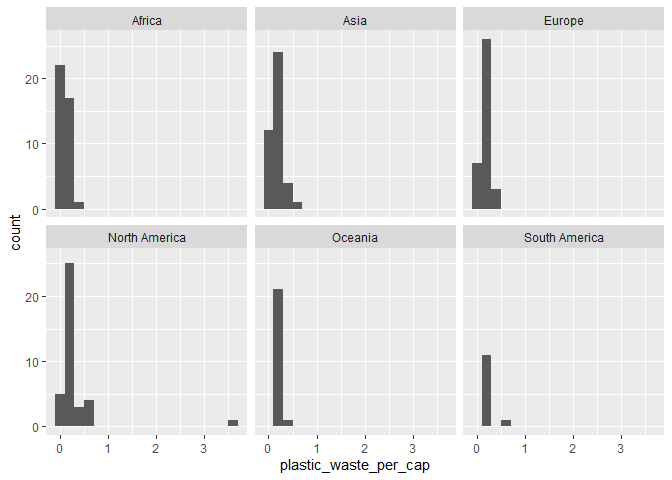
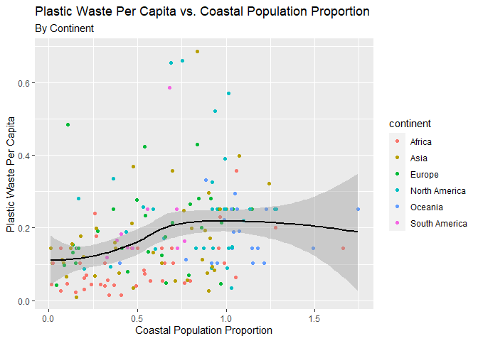

Lab 02 - Plastic waste
================
Fanyi Zeng
1/30/22

## Load packages and data

``` r
library(tidyverse) 
```

``` r
plastic_waste <- read.csv("data/plastic-waste.csv")
```

## Exercises

### Exercise 1

Plot, using histograms, the distribution of plastic waste per capita
faceted by continent. It seems that North America has a really high
outlier.

``` r
ggplot(data = plastic_waste, aes(x = plastic_waste_per_cap)) +
  geom_histogram(binwidth = 0.2) +
  facet_wrap(~continent)
```

    ## Warning: Removed 51 rows containing non-finite values (stat_bin).

<!-- -->

### Exercise 2

Another way of visualizing numerical data is using density plots. And
compare distributions across continents by coloring density curves by
continent. The resulting plot may be a little difficult to read, so
let’s also fill the curves in with colors as well.

``` r
ggplot(data = plastic_waste, 
       mapping = aes(x = plastic_waste_per_cap, 
                     color = continent, 
                     fill = continent)) +
  geom_density(alpha = 0.5)
```

    ## Warning: Removed 51 rows containing non-finite values (stat_density).

<!-- -->

### Exercise 3

And yet another way to visualize this relationship is using side-by-side
box plots.

``` r
ggplot(data = plastic_waste, 
       mapping = aes(x = continent, 
                     y = plastic_waste_per_cap)) +
  geom_boxplot()
```

    ## Warning: Removed 51 rows containing non-finite values (stat_boxplot).

<!-- -->

### Exercise 4

Convert your side-by-side box plots from the previous task to violin
plots. To compare, the violin plot shows the shape of the distribution,
whereas the box plot shows more discreet points.

``` r
ggplot(data = plastic_waste, 
       mapping = aes(x = continent, 
                     y = plastic_waste_per_cap)) +
  geom_violin()
```

    ## Warning: Removed 51 rows containing non-finite values (stat_ydensity).

<!-- -->

### Exercise 5

Visualize the relationship between plastic waste per capita and
mismanaged plastic waste per capita using a scatterplot. The
relationship is positive.

``` r
ggplot(data = plastic_waste, 
       mapping = aes(x = plastic_waste_per_cap, 
                     y = mismanaged_plastic_waste_per_cap)) +
  geom_point()
```

    ## Warning: Removed 51 rows containing missing values (geom_point).

<!-- -->

### Exercise 6

Color the points in the scatterplot by continent. The associations are
stronger for Asia, Oceania, and Africa, and are weaker for Europe, North
America, and South America.

``` r
ggplot(data = plastic_waste, 
       mapping = aes(x = plastic_waste_per_cap, 
                     y = mismanaged_plastic_waste_per_cap,
                     color = continent)) +
  geom_point()
```

    ## Warning: Removed 51 rows containing missing values (geom_point).

<!-- -->

### Exercise 7

Visualize the relationship between plastic waste per capita and total
population as well as plastic waste per capita and coastal population.
You will need to make two separate plots. The second association seems
stronger.

``` r
ggplot(data = plastic_waste, 
       mapping = aes(x = plastic_waste_per_cap, 
                     y = total_pop)) +
  geom_point()
```

    ## Warning: Removed 61 rows containing missing values (geom_point).

<!-- -->

``` r
ggplot(data = plastic_waste, 
       mapping = aes(x = plastic_waste_per_cap, 
                     y = coastal_pop)) +
  geom_point()
```

    ## Warning: Removed 51 rows containing missing values (geom_point).

<!-- -->

### Exercise 8

Plastic waster per capita vs. coastal population proportion by
continent.

``` r
ggplot(filter (plastic_waste, plastic_waste_per_cap < 3), 
       aes(x = coastal_pop/total_pop,
                     y = plastic_waste_per_cap,
                     color = continent)) +
  geom_point() +
  labs(x = "Coastal Population Proportion", y = "Plastic Waste Per Capita", title = "Plastic Waste Per Capita vs. Coastal Population Proportion", subtitle = "By Continent")
```

    ## Warning: Removed 10 rows containing missing values (geom_point).

<!-- -->

## Pro-Tips

### Excercise 3

Try this :D

ggplot(data = plastic_waste, mapping = aes(x = continent, y =
plastic_waste_per_cap)) + geom_violin()+ geom_boxplot(width=.3,
fill=“green”) + stat_summary(fun.y=median, geom=“point”)

### Exercise 5

Helpful
reference:<http://www.sthda.com/english/wiki/ggplot2-themes-and-background-colors-the-3-elements>
